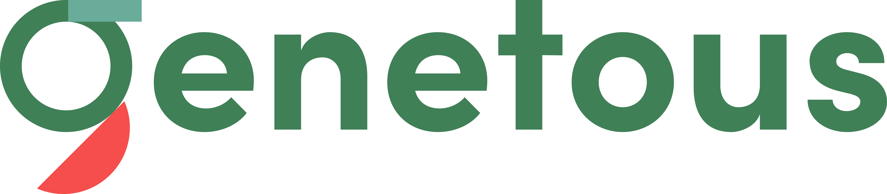

# **Genetous** Support Basic Social App

**Genetous** is a Low Code Support BaaS Platform.

**Genetous** include full-generic micro-services to develop backendless projects.

This app enables to understand how **Genetous BaaS** works.

## **About Social App**


In order to use the application, ApplicationId and OrganizationId information in ApiClass must be set.

```java
public static String applicationId="xxxxx-xxxx-xxx-xxxx-xx";
public static String organizationId="xxxxxxxxxxxxxxxxxxx";
```
And also must be set service IP

```java
static String ip="your server ip";
```
Please contact us to test this app!!!

<http://www.genetous.com>

<info@genetous.com>

### All rights of this application reseverd to **Genetous BaaS Platform**.
